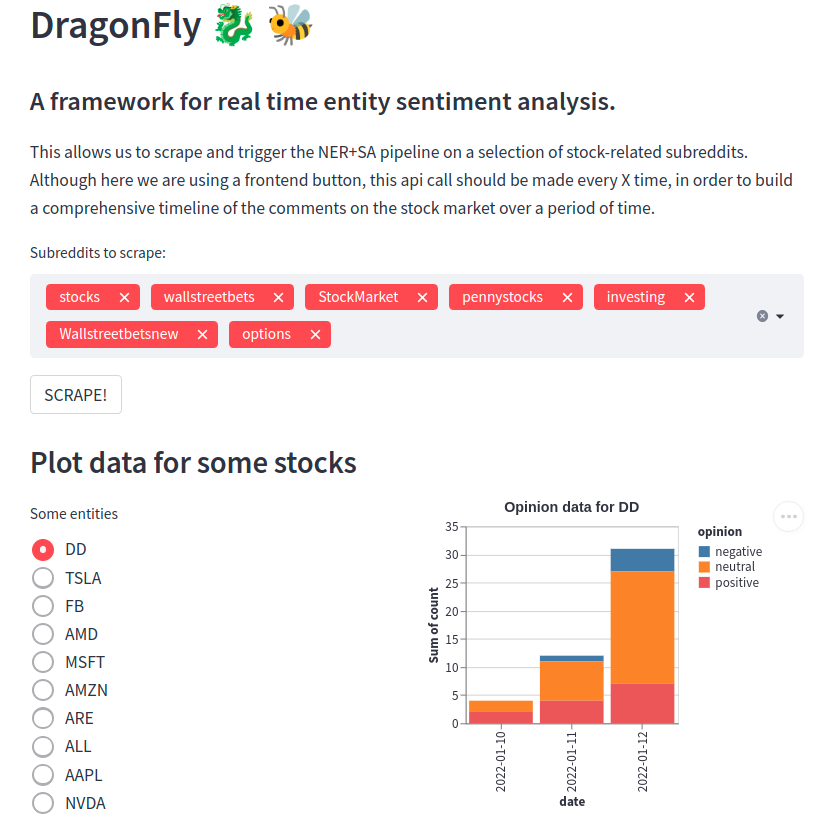
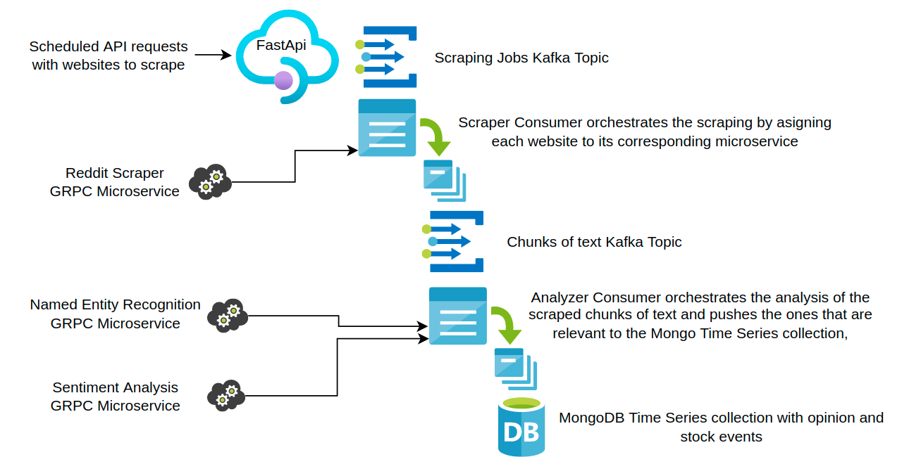

# DragonFly
Real time sentiment analysis on entities from scraped text.

## Overview

The vision behind this project is to create an events collection that is thought to be a historical archive of heterogenous events (sentiment of twitter/reddit comments on a company/crypto/party and the market fluctuations of the stock/coin or political polls). Both the easy-to-scale nature of the grpc micro-services and the asynchronous capabilities of kafka topics, backed by the consistency of MongoDB, build towards a real-time opinion temperature of an entity in this fast-moving internet, where a subreddit or telegram can x900% a crypto in hours or a twitter influencer can cascade a political opinion into virality.

Streamlit frontend to showcase the capabilities of the project. On the first block, we can scrape the lasts posts from some well-known stock subreddits. On a more serious setting of this tool, this should be done via scheduled api calls, in oder to get a nice coverage of the website in the events time series.

We also plot some of the data scraped during the first days of testing.

## Architecture

This project tries to give an infrastructure for real-time monitoring of websites on any domain where it is valued to know an opinion regarding an entity. In the basic example submitted to this hackathon, the system is built to monitor the sentiment regarding stock companies on subreddits and generate a timeline of events, those are, positive or negative comments on a certain entity.

The focus of the project is flexibility, wrapping all computationally intensive and domain-dependent elements (scrapers for websites or ML) in grpc microservices, that get called by consumers to populate an event driven architecture (some Kafka topics) that ends up dumping curated events to a MongoDB Time Series. This time series can then be the backbone for dashboards or opinion triggers build on top of it.

